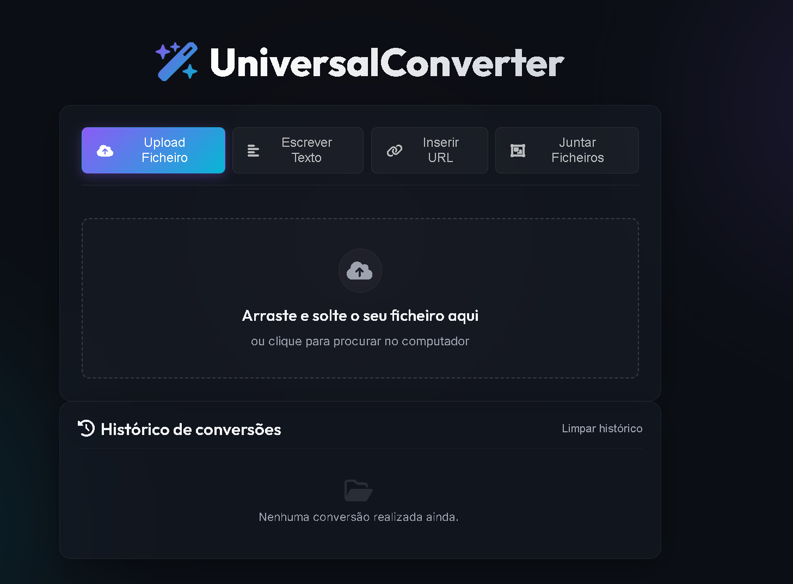
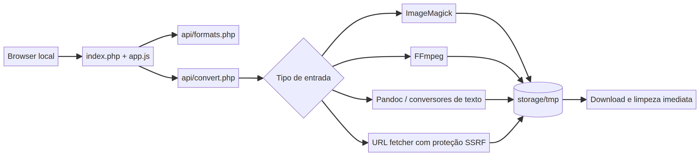

# UniversalConverter

[](https://github.com/josepires-dev/UniversalConverter/actions/workflows/ci.yml)
[](LICENSE)

> Local PHP/Apache file converter for XAMPP, Laragon, WAMP, or any Apache + PHP 8.1+ stack.

UniversalConverter is a native PHP rewrite of the original project. It provides local conversion for images, vectors, documents, audio, and video without Flask, Python, virtual environments, or an emulator server.

## Demo



The screenshot shows the main local workflow: upload a file, write text, insert a URL, or combine files. No uploaded content is sent to a third-party service by the application.



> **Local-use notice:** This application is designed for use on a personal machine through Apache. Do not expose it directly to the public Internet without a dedicated security review and an appropriate authentication layer.

## Features

| Area | Supported behavior |
|---|---|
| Graphics | PNG, JPG, WEBP, PDF, GIF, SVG, ICO, and other formats exposed by ImageMagick |
| Video | MP4, WEBM, MKV, AVI, and MOV conversion with FFmpeg |
| Audio | MP3, WAV, M4A, AAC, and other FFmpeg-supported formats |
| Image controls | Resize, rotate, and quality adjustments through ImageMagick |
| Video controls | Resize, rotate, and quality adjustments through FFmpeg |
| Privacy | Uploaded files are kept in a request-specific temporary directory and removed after delivery |
| History | Conversion history is stored only in browser `localStorage` and can be cleared from the interface |
| Downloads | Converted files are returned directly by Apache as `original_converted.ext` |

## Installation

1. Extract the repository into `C:\xampp\htdocs\UniversalConverter`.
2. In the XAMPP `php.ini`, enable `file_uploads=On`, set `upload_max_filesize=100M`, and set `post_max_size=110M` or higher.
3. Make sure `proc_open` is not listed in `disable_functions`.
4. Start or restart Apache from the XAMPP control panel.
5. Open `http://localhost/UniversalConverter/` in your browser.

On Windows, `setup.ps1` or `setup.bat` can prepare the expected folders and run the environment diagnostic. These scripts do not download third-party executables; they intentionally leave that step to the official download sources in [`tools/README.md`](tools/README.md).

After installation, run the environment diagnostic from the project directory:

```powershell
php cli.php doctor
```

The command checks PHP, `proc_open`, upload settings, writable temporary storage, the PHP ZIP extension and the external executables required by each conversion mode.

The same application can be used with Laragon, WAMP, or another Apache + PHP 8.1+ environment after adapting the document root and PHP configuration.

## External tools

Runtime executables are intentionally **not committed** because they are large third-party distributions. Download them from their official sources and place the required files in the corresponding directories under `tools/`:

| Directory | Tool | Official source |
|---|---|---|
| `tools/imagemagick/` | ImageMagick (`magick.exe`, `identify.exe`) | [imagemagick.org](https://imagemagick.org/script/download.php#windows) |
| `tools/ffmpeg/` | FFmpeg (`ffmpeg.exe`) | [ffmpeg.org](https://ffmpeg.org/download.html) |
| `tools/pandoc/` | Pandoc (`pandoc.exe`) | [Pandoc releases](https://github.com/jgm/pandoc/releases) |
| `tools/poppler/` | Poppler PDF utilities | Use a compatible official or distribution-provided build |

After installation, confirm that each executable is directly inside the expected directory, for example `tools/ffmpeg/ffmpeg.exe`. See [`tools/README.md`](tools/README.md) for download links, expected paths and the repository policy on third-party tools.

## Formats and limitations

The format search list is generated from the installed ImageMagick distribution through `identify -list format` and filtered to formats available in that build. Common graphics formats such as PNG, JPEG, WEBP, BMP, TIFF, GIF, and ICO are the primary path.

Video and audio inputs are routed to FFmpeg. The application targets MP4/MOV with H.264 and AAC, WEBM with VP9/Opus, MKV with H.264/AAC, and AVI with MPEG-4/MP3. PDF/EPS/PS reading and some video formats may require external delegates such as Ghostscript or FFmpeg.

Conversion of Word, Excel, and PowerPoint files to PDF in the original Python project depended on Microsoft Office automation on Windows. This XAMPP version does not include or emulate Microsoft Office; export those documents to PDF first, then convert the PDF with UniversalConverter.

The interface exposes configured target formats, while actual conversion support depends on the installed tool build and delegates. The most reliable tested paths in this repository are PNG/JPEG/WebP/GIF through ImageMagick, MP4/WEBM/MKV/AVI through FFmpeg, Markdown from TXT/Python/PDF/URL, and Python to IPYNB. Other ImageMagick formats, codecs, PDF delegates, and platform-specific inputs should be treated as installation-dependent.

## API examples

List the formats available in the current installation:

```bash
curl http://localhost/UniversalConverter/api/formats.php
```

Convert a text file to Markdown and save the returned file:

```bash
curl -X POST \
  -F "file=@notes.txt" \
  -F "format=md" \
  http://localhost/UniversalConverter/api/convert.php \
  -o notes_convertido.md
```

The conversion endpoint returns the converted file on success and a JSON object such as `{"error":"..."}` on failure. The endpoint is intended for local use and should not be exposed publicly without authentication and an additional security review.

## Security considerations

The application limits uploads to 100 MB, limits image dimensions to 16,000 px, protects temporary files and libraries from direct web access, blocks URL delegates in ImageMagick, and removes request-specific temporary files after processing. Do not change `tools/imagemagick/policy.xml` to enable external sources or indirect paths.

URL conversion resolves the target host and blocks RFC1918 and loopback ranges, including `127.x`, `10.x`, `172.16.x–172.31.x`, and `192.168.x`, to mitigate server-side request forgery (SSRF). See [`SECURITY.md`](SECURITY.md) before deploying or modifying the application.

## Troubleshooting

| Message or symptom | Recommended action |
|---|---|
| `Portable ImageMagick was not found` | Check that the required ImageMagick files were extracted into `tools/imagemagick/` |
| `proc_open` is disabled | Remove `proc_open` from `disable_functions` in `php.ini` and restart Apache |
| Unsupported format | Choose a format listed by the interface or install the delegate required by that format |
| `ReadVIDEOImage` error | Ensure video and audio inputs are being handled by the current FFmpeg path |
| Upload exceeds the limit | Reduce the input size or raise PHP limits while keeping the application limit intentional |

## Contributing

Please read [`CONTRIBUTING.md`](CONTRIBUTING.md) before opening a pull request. Do not commit executables, uploaded files, generated output, credentials, or personal data.

Every push and pull request is checked by GitHub Actions on PHP 8.1, 8.2 and 8.3. The CI job runs PHP syntax validation, smoke tests, regression tests and documentation checks. Run the same validation locally with `php tests/smoke.php` and `php tests/regression.php`.

## Releases and maintenance

Released versions use [Semantic Versioning](https://semver.org/). The full history of user-visible changes is maintained in [`CHANGELOG.md`](CHANGELOG.md); GitHub Releases provide a downloadable snapshot for each stable version. Dependabot checks the GitHub Actions workflow weekly and opens a pull request when an action needs an update.

## License

The UniversalConverter source code is released under the [MIT License](LICENSE). The repository also includes third-party notices, including the license for the AnyDoc WASM component in [`licenses/`](licenses/).
